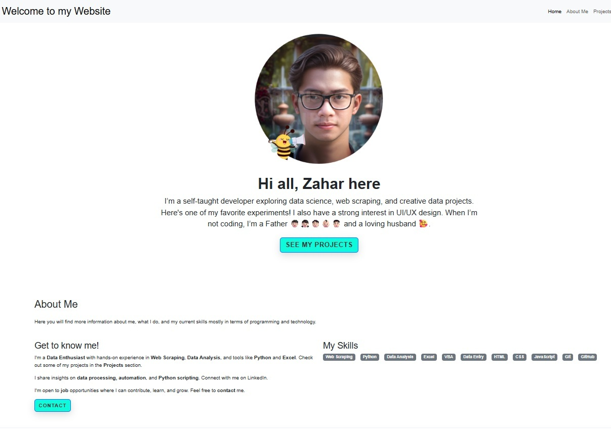

# My Nice Portfolio

Welcome to my personal portfolio website! This project showcases my work, skills, and experiences.

## 🚀 Live Demo

Check out the live version here: [zaharscript.github.io/my-nice-portfolio](https://zaharscript.github.io/my-nice-portfolio)

## 🛠️ Built With

- HTML5
- CSS3
- Bootstrap 5.3
- JavaScript

## 📸 Screenshots




## 📂 Project Structure

my-nice-portfolio/
├── index.html
├── style.css
├── assets/
│ ├── images/
└── README.md

## 📦 Features

- Responsive design for various devices
- Interactive components using Bootstrap
- Clean and modern UI

## 🧰 Getting Started

To view the project locally:

1. Clone the repository:

   ```bash
   git clone https://github.com/zaharscript/my-nice-portfolio.git

   ```

2. Navigate to the project directory:

```bash
cd my-nice-portfolio
```

3. Open index.html in your preferred browser.

🤝 Contributing
Contributions are welcome! Please fork the repository and submit a pull request for any enhancements or bug fixes.

📄 License
This project is licensed under the MIT License.

📬 Contact
Feel free to reach out:

✉️Email: khairun_nas@hotmail.com

🔗LinkedIn: linkedin.com/in/zaharudin-mokhtar-251932115/

🐦x: https://x.com/AcitZaha
